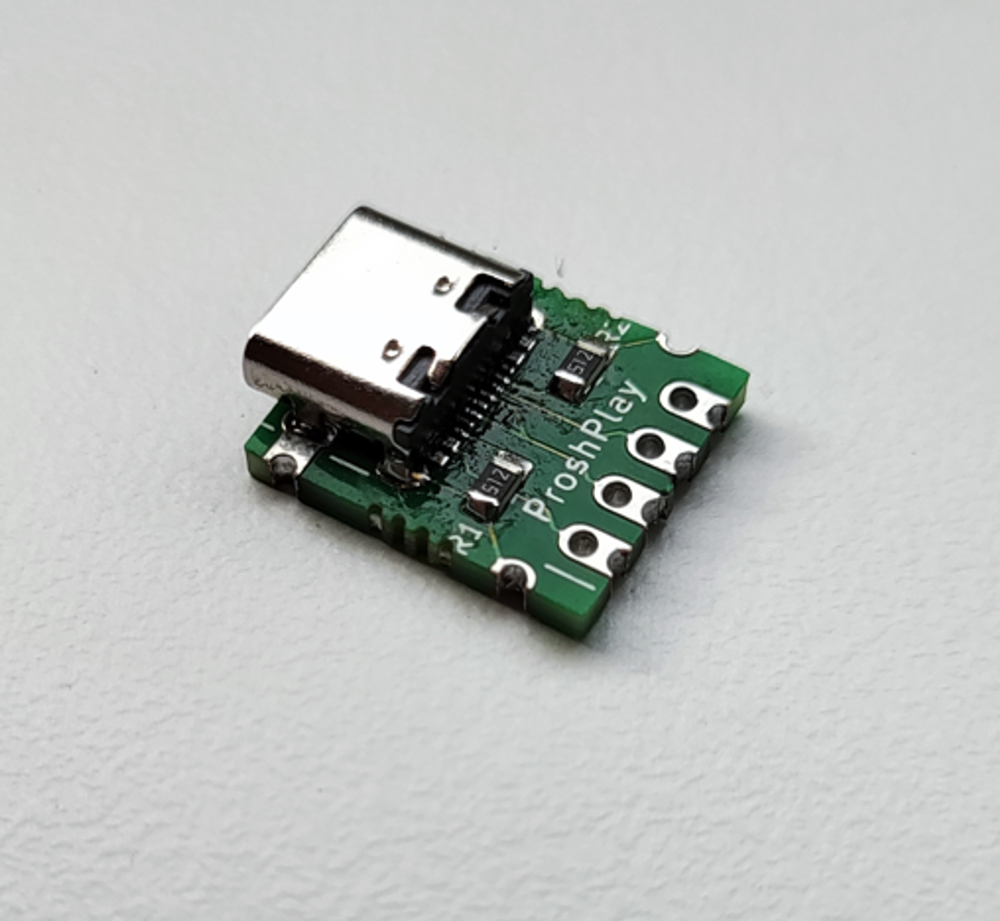
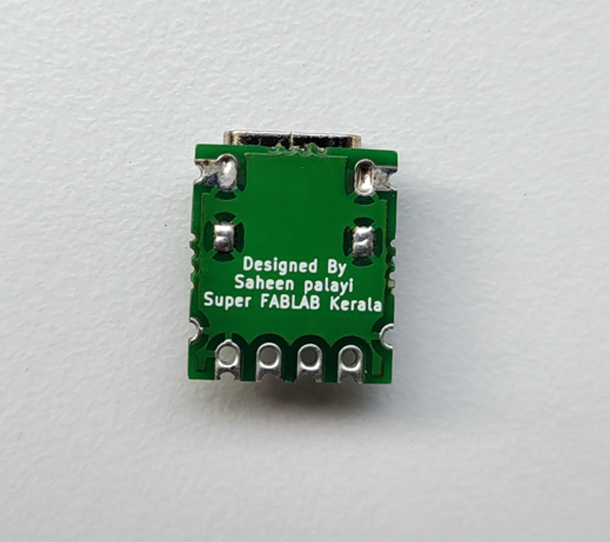
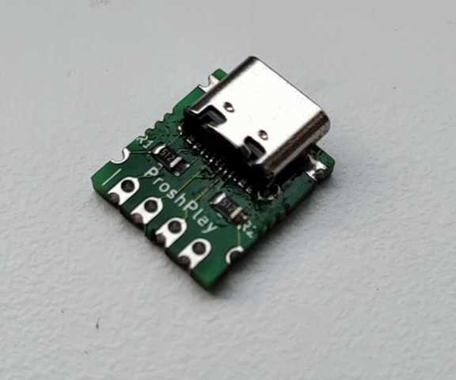
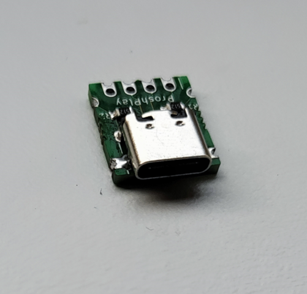

# ProshPlay-Type_C-Breakout_Board

It's Hard to mill and solder Type C sockets in the Fab Prototyping PCBs So decided to make a breakout board to clear this issue and the breakout board can be mass manufacturable in less cost and can be assembled using a pick and place machine at the fab 

  

PCB made by Fab academy 2023 student [Sreyas George](https://fabacademy.org/2023/labs/kochi/students/sreyas-george/)

Downloads
 - [Kicad Library](https://github.com/saheenpalayi/ProshPlay-Type_C-Breakout_Board/raw/main/Library%20Files/Kicad/ProshPlay-Type_C-Breakout_Board.zip)
 - [Gerber File](https://github.com/saheenpalayi/ProshPlay-Type_C-Breakout_Board/raw/main/Gerber%20Files/V1/type-C-Breakout.zip)